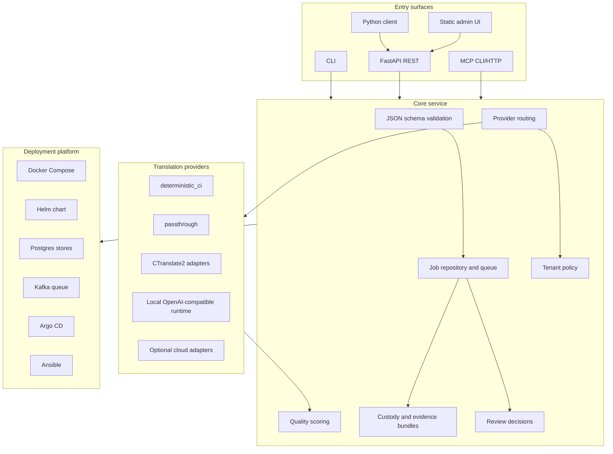

# Architecture

EDC Translation is a contract-first translation control plane. It normalizes input into `DocumentBundle v1`, routes the work to a configured provider, emits `TranslationBundle v1`, and exposes job, quality, custody, review, and readiness surfaces through REST, CLI, Python, and MCP-style tools.

For the longer version, read [docs/00-SYSTEM-BLUEPRINT.md](docs/00-SYSTEM-BLUEPRINT.md).

## Component Diagram

## Data Contracts

`DocumentBundle v1` is the input contract. It carries document identity, source spans, page references, language metadata, upstream engine metadata, custody fields, and artifact references.

`TranslationBundle v1` is the output contract. It carries translated spans, provider metadata, model provenance, quality scores, source linkage, glossary hits, custody fields, and review-friendly evidence references.

## Runtime Boundaries

| Boundary | Control |
|---|---|
| Caller to API | Auth middleware, tenant binding, and route scopes. |
| Service to provider | Explicit provider ID, auto-route diagnostics, license gates, and live-smoke gates. |
| Service to store | Backend selection through environment variables. |
| Batch to filesystem | Operator-provided paths; deployment should restrict allowed roots. |
| Public examples | Deterministic provider only unless optional provider setup is being documented. |

## Deployment Shape

Local development uses in-memory or file-backed state. Staging and production-like profiles should use non-disabled auth, Postgres-backed stores where durability is required, optional Kafka fanout, and explicit provider configuration.
