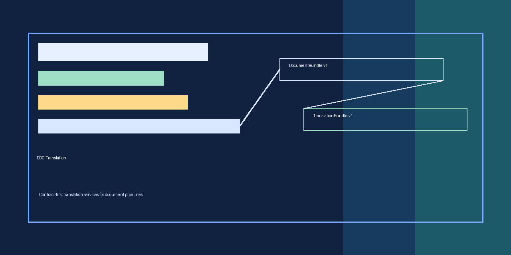
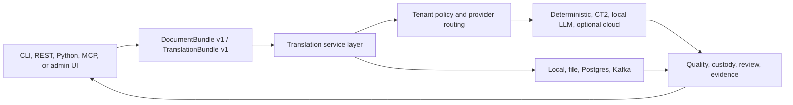

<p align="center">
  
</p>

# EDC Translation

Contract-first translation services for eDiscovery, review, and structured document-processing pipelines.

[](https://github.com/mattmre/EDCTRANSLATION-PUBLIC/actions/workflows/ci.yml)
[](https://github.com/mattmre/EDCTRANSLATION-PUBLIC/actions/workflows/container-scan.yml)
[](https://github.com/mattmre/EDCTRANSLATION-PUBLIC/discussions)
[](CONTRIBUTING.md)
[](LICENSE)
[](https://github.com/mattmre/EDCTRANSLATION-PUBLIC/releases)

EDC Translation accepts raw text or `DocumentBundle v1` JSON and emits `TranslationBundle v1` JSON. It keeps source span identity, provider metadata, quality fields, custody references, and review hooks attached to translated output so downstream systems can validate and audit the result.

The repository includes a deterministic CI provider, passthrough provider, optional local CT2 adapters, optional local OpenAI-compatible runtime adapters, optional OpenRouter/Gemini adapters, FastAPI service, CLI tools, MCP-style CLI/HTTP tools, batch text translation, custody/evidence surfaces, Helm charts, GitOps scaffolding, Ansible deployment templates, and a static public presentation site.

## 30-Second Quickstart

Windows PowerShell:

```powershell
py -3.11 -m venv .venv
.\.venv\Scripts\Activate.ps1
python -m pip install --upgrade pip
python -m pip install -e ".[dev]"
edc-translation submit-text "Hello world." --source en --target fr --provider deterministic_ci
uvicorn edc_translation.api:app --host 127.0.0.1 --port 8080
```

Linux/macOS:

```bash
python3.11 -m venv .venv
source .venv/bin/activate
python -m pip install --upgrade pip
python -m pip install -e ".[dev]"
edc-translation submit-text "Hello world." --source en --target fr --provider deterministic_ci
uvicorn edc_translation.api:app --host 127.0.0.1 --port 8080
```

Open:

- `http://127.0.0.1:8080/healthz`
- `http://127.0.0.1:8080/readyz`
- `http://127.0.0.1:8080/docs`
- `http://127.0.0.1:8080/admin`

Docker users can run the local smoke stack:

```bash
docker compose -f docker-compose.local.yml up --build
```

## System Overview



## What It Is

| Capability | Included |
|---|---|
| Contract validation | Public JSON Schemas for document and translation bundles. |
| Deterministic local path | Credential-free provider for tests, docs, and CI. |
| Provider control plane | Explicit provider IDs, auto-route diagnostics, license gates, live-smoke gates. |
| Runtime surfaces | REST API, CLI, Python client, MCP-style CLI/HTTP wrapper, static admin UI. |
| Batch workflows | Recursive text-file translation with logs, manifests, and optional sidecar bundles. |
| Evidence surfaces | Quality, custody, review, model validation, and release-readiness metadata. |
| Deployment scaffolding | Python, Docker, Compose, Helm, GitOps, Ansible. |

## What It Is Not

- Not an OCR extraction engine.
- Not a hosted SaaS.
- Not a model-weight distribution repo.
- Not a blind proxy to live providers.
- Not legal advice or automatic certification.

## Documentation

| Start here | Purpose |
|---|---|
| [Install](INSTALL.md) | Python, optional extras, Docker, and Compose install paths. |
| [Development](DEVELOPMENT.md) | Local development, tests, lint, package, docs, and release hygiene. |
| [Architecture](ARCHITECTURE.md) | System design, trust boundaries, and deployment shape. |
| [Docs index](docs/README.md) | Full public documentation suite. |
| [API reference](docs/API-REFERENCE.md) | REST, CLI, MCP-style tools, and route scopes. |
| [Contracts reference](docs/07-CONTRACTS-REFERENCE.md) | `DocumentBundle v1` and `TranslationBundle v1` field guidance. |
| [Provider operations](docs/08-PROVIDER-OPERATIONS.md) | Local model, CT2, auto-route, and live-provider controls. |
| [Deployment](docs/05-DEPLOYMENT.md) | Compose, Helm, GitOps, Ansible, auth, stores, and rollout checks. |
| [Wiki source](wiki/Home.md) | GitHub-wiki-ready pages maintained in-tree. |
| [Presentation](presentation/index.html) | Static public microsite and slide deck. |

## Provider Quick Reference

| Provider | Best use |
|---|---|
| `deterministic_ci` | Public examples, CI, integration smoke. |
| `passthrough` | Same-language plumbing checks. |
| `local_ct2_opus` / `local_ct2_nllb` / `local_ct2_madlad` | Operator-reviewed local CT2 model directories. |
| `local_openai_compat` | Local `/v1/models` and `/v1/chat/completions` runtimes. |
| `openrouter_llm` / `google_gemini` | Optional live-provider experiments behind explicit credentials and smoke opt-in. |

## Validation

```bash
python -m ruff check edc_translation tests
PGCONNECT_TIMEOUT=2 python -m pytest -q
docker compose -f docker-compose.local.yml config --quiet
EDC_TRANSLATION_POSTGRES_PASSWORD=local-dev-password EDC_JWT_SECRET=local-dev-jwt-secret docker compose -f docker-compose.prod.yml config --quiet
helm lint helm/edc-translation
helm template edc-translation helm/edc-translation
```

PowerShell users should set `$env:PGCONNECT_TIMEOUT="2"` before running pytest, then set `$env:EDC_TRANSLATION_POSTGRES_PASSWORD="local-dev-password"` and `$env:EDC_JWT_SECRET="local-dev-jwt-secret"` before validating the production-like Compose file.

## Contributing

Issues and pull requests are welcome. Start with [CONTRIBUTING.md](CONTRIBUTING.md), open a GitHub Discussion for design questions, and use the PR checklist to keep generated commits free of AI/LLM co-author footers.

## Contributors

<a href="https://github.com/mattmre/EDCTRANSLATION-PUBLIC/graphs/contributors">
  
</a>

## Star History

<a href="https://star-history.com/#mattmre/EDCTRANSLATION-PUBLIC&Date">
  <picture>
    <source media="(prefers-color-scheme: dark)" srcset="https://api.star-history.com/svg?repos=mattmre/EDCTRANSLATION-PUBLIC&type=Date&theme=dark">
    <source media="(prefers-color-scheme: light)" srcset="https://api.star-history.com/svg?repos=mattmre/EDCTRANSLATION-PUBLIC&type=Date">
    
  </picture>
</a>

## Links

[Issues](https://github.com/mattmre/EDCTRANSLATION-PUBLIC/issues) | [Discussions](https://github.com/mattmre/EDCTRANSLATION-PUBLIC/discussions) | [Security](SECURITY.md) | [License](LICENSE)
