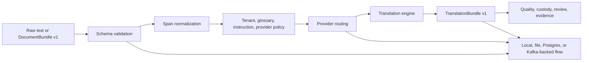
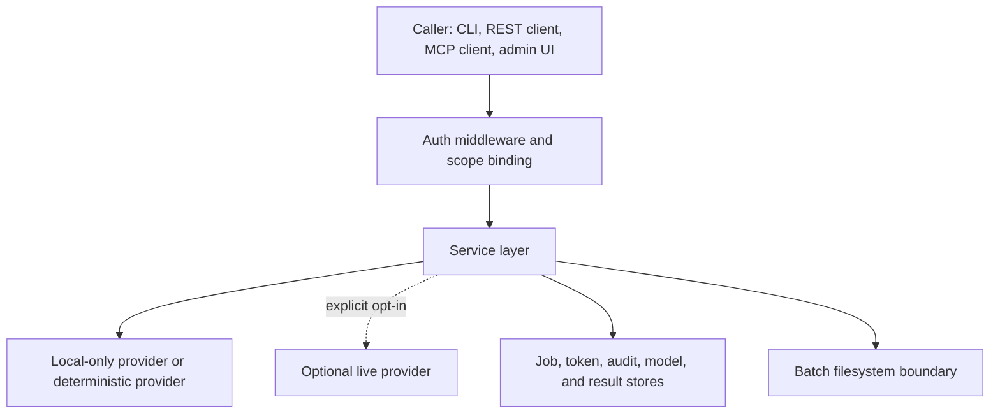

# System Blueprint

EDC Translation is a contract-first translation control plane for structured document workflows. It accepts raw text or `DocumentBundle v1`, validates the input, routes the request through an explicit provider policy, and emits `TranslationBundle v1` with provider, quality, custody, and review metadata.

The project is intentionally narrow: it does not extract OCR text, host a managed SaaS, or ship model weights. It gives downstream systems a reproducible way to translate document text while preserving source span identity and review evidence.

## Product Boundary

| In scope | Out of scope |
|---|---|
| `DocumentBundle v1` ingestion and schema validation | OCR extraction, image preprocessing, or layout recovery |
| Raw text normalization into a document-like bundle | Human vendor procurement and translator workforce management |
| `TranslationBundle v1` output with span linkage | Shipping translation model weights in the repository |
| Deterministic, passthrough, CT2, local OpenAI-compatible, and optional cloud adapters | Guaranteeing provider quality beyond documented adapter behavior |
| REST, CLI, Python client, MCP-style CLI/HTTP tools, and static admin UI | Fully managed production hosting |
| Local, Docker Compose, Helm, GitOps, and Ansible deployment scaffolding | Customer-specific infrastructure hardening |
| Job state, batch text workflows, custody metadata, review records, and release-readiness checks | Legal advice about admissibility or data residency |

## Architecture Overview

## Core Components

| Component | Files | Responsibility |
|---|---|---|
| REST API | `edc_translation/api.py` | FastAPI endpoints for translation, jobs, engines, languages, files, custody, review, auth-scoped operations, and admin HTML. |
| Service layer | `edc_translation/service.py` | Shared orchestration used by REST, CLI, MCP, worker, and tests. |
| Contracts | `edc_translation/contracts.py`, `schemas/*.json` | JSON Schema loading and validation for public bundle formats. |
| Routing | `edc_translation/routing.py`, `edc_translation/governance.py` | Explicit and auto provider resolution with license and tenant-policy checks. |
| Providers | `edc_translation/engines/`, `edc_translation/llm_live.py` | Deterministic, passthrough, CT2, local OpenAI-compatible, OpenRouter, and Gemini adapter paths. |
| Jobs and queues | `edc_translation/jobs.py`, `edc_translation/stores.py`, `edc_translation/postgres_backend.py`, `edc_translation/kafka_backend.py` | Local state, durable stores, queue abstractions, Postgres, and Kafka fanout. |
| Worker | `edc_translation/worker.py` | Polling or queue-backed translation execution for asynchronous deployments. |
| MCP tools | `edc_translation/mcp.py`, `edc_translation/mcp_http.py` | Agent/tool-compatible surfaces over the same service layer. |
| Admin UI | `edc_translation/static/admin.html` | Static local operations page for smoke workflows and manual inspection. |
| Release readiness | `edc_translation/release_readiness.py` | Evidence-lane checks for auth, deployment, local evidence, and live-provider smoke artifacts. |

## Entry Surfaces

| Surface | Best use | Command or path |
|---|---|---|
| CLI | Local smoke, automation, deterministic examples | `edc-translation ...` |
| REST API | Application integration and admin UI | `uvicorn edc_translation.api:app --host 127.0.0.1 --port 8080` |
| Python client | In-process integration with the API | `edc_translation/client.py` |
| MCP CLI | Tool listing and JSON tool calls | `edc-translation-mcp --list-tools` |
| MCP HTTP | Local tool server | `edc-translation-mcp-http --host 127.0.0.1 --port 8081` |
| Worker | Queue or store-backed asynchronous processing | `edc-translation-worker ...` |

## Trust Boundaries

| Boundary | Control |
|---|---|
| Caller to API | Auth middleware, tenant binding, route scopes, disabled-auth rejection outside local mode. |
| Service to provider | Explicit provider ID, `auto` diagnostics, non-commercial license gate, live-smoke gate. |
| Service to filesystem | Batch text workflows require operator-provided paths and should be deployment-restricted. |
| Service to stores | Local, JSON, Postgres, and Kafka paths are separated by environment variables. |
| Public release | Release-readiness checks avoid auto-claiming full readiness without evidence artifacts. |

## Provider Families

| Provider ID | Family | Local/cloud | Notes |
|---|---|---|---|
| `deterministic_ci` | `passthrough` | Local | Repeatable translation marker for tests, docs, and CI. |
| `passthrough` | `passthrough` | Local | Preserves content, especially same-language flows. |
| `local_ct2_opus` | `ct2_nmt` | Local | Optional CTranslate2/SentencePiece OPUS path. |
| `local_ct2_nllb` | `ct2_nmt` | Local | Optional NLLB path; non-commercial license handling matters. |
| `local_ct2_madlad` | `ct2_nmt` | Local | Optional MADLAD path. |
| `local_openai_compat` | `llm_local` | Local | Works with local `/v1/models` and `/v1/chat/completions` runtimes. |
| `openrouter_llm` | `llm_cloud` | Cloud | Optional live provider path behind explicit credentials and smoke gate. |
| `google_gemini` | `llm_cloud` | Cloud | Optional Gemini path behind explicit credentials and smoke gate. |

## Contract Flow

1. Raw text requests become a minimal normalized document bundle.
2. Bundle requests are validated against `schemas/document-bundle-v1.schema.json`.
3. Routing resolves explicit, tenant-default, or `auto` provider selection.
4. The provider emits translated span text plus provider metadata.
5. The service assembles `TranslationBundle v1`.
6. Job, custody, evidence, review, and optional batch outputs are persisted through the configured stores.

## Public Maturity

The public repo is suitable for deterministic local evaluation, API integration, CI contract testing, deployment-shape review, and operator-controlled provider experiments. Teams should perform their own model-quality, license, data-retention, auth, and infrastructure reviews before using live providers or sensitive document workflows.
