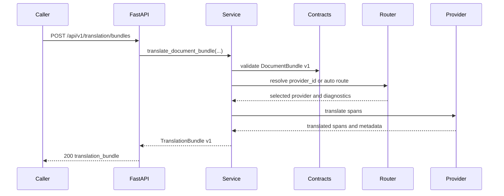
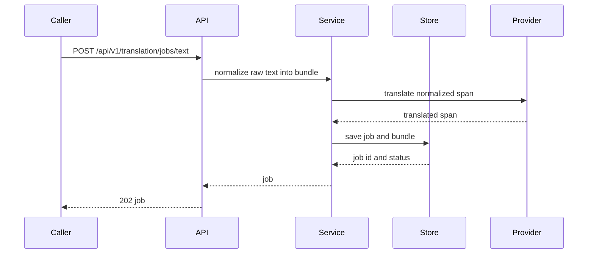
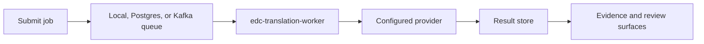
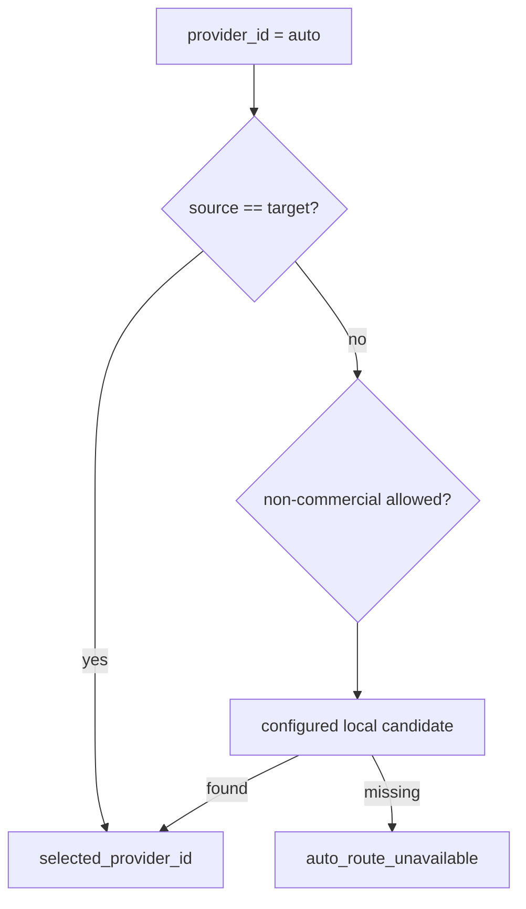
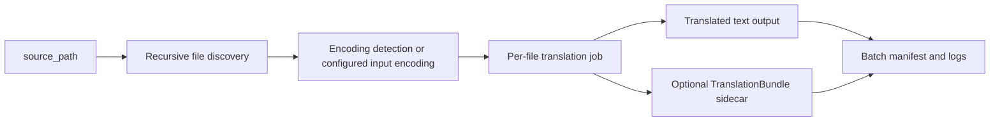

# Information Flows

EDC Translation keeps the translation decision visible. Input validation, routing, provider execution, job persistence, review, and evidence metadata are separate steps instead of a single opaque provider call.

## Synchronous Bundle Translation

## Asynchronous Text Job

## Worker And Queue Flow

| Step | Behavior |
|---|---|
| Submit | The API or CLI records job intent, target language, provider ID, tenant ID, and request metadata. |
| Queue | Local queue is fastest for development; Postgres and Kafka support durable or distributed processing. |
| Worker | Worker resolves providers through the same service layer as API and CLI. |
| Provider | Provider execution can be deterministic, local model runtime, or opt-in live provider. |
| Results | Completed bundles and failures are written through the configured job backend. |

## Auto-Route Flow

Auto-route is intentionally conservative:

- Same-language requests can select `passthrough`.
- Configured local model candidates can be selected.
- Non-commercial licensed providers stay blocked unless `allow_nc_licensed` is true.
- Missing configuration returns diagnostics instead of silently selecting an unknown provider.

## Batch Text Flow

Batch jobs are useful for folders of `.txt` files. They are not a substitute for document extraction or access-control policy. Shared deployments should restrict allowed source and output paths.

## Review And Evidence Flow

1. A translation job produces a bundle with provider metadata and custody fields.
2. A caller retrieves `/api/v1/translation/jobs/{job_id}/evidence`.
3. A reviewer posts a decision to `/api/v1/translation/jobs/{job_id}/reviews`.
4. The review record is listed through `/api/v1/translation/reviews`.
5. Release-readiness checks can evaluate whether required evidence lanes have supporting artifacts.

## Failure Flow

| Failure | Public behavior |
|---|---|
| Invalid document bundle | Schema validation fails before provider execution. |
| Auto-route cannot select a provider | API returns `409` or readiness returns `503` with diagnostics. |
| Provider endpoint unreachable | Live provider smoke returns a bounded failure payload. |
| Job not found | API returns `404`. |
| Bundle requested before completion | API returns `409`. |
| Missing auth scope | API returns an authorization error through middleware. |
