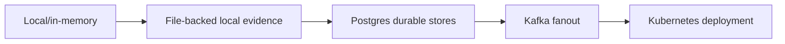

# Deployment

EDC Translation supports a graduated deployment path: Python for development, Docker Compose for local integration, staging-like Compose for durable-store validation, Helm for Kubernetes, GitOps for repeatable cluster rollout, and Ansible for inventory-driven automation.

## Deployment Modes

| Mode | Best for | Auth posture | Store posture |
|---|---|---|---|
| Python editable install | Fast local development and CLI/API smoke | `EDC_AUTH_MODE=disabled` acceptable only with `EDC_DEPLOYMENT_ENV=local` | Local in-memory/file-backed defaults |
| `docker-compose.local.yml` | API, MCP, mock LLM, Redpanda local integration | Local-only smoke | Local or container-local dependencies |
| `docker-compose.prod.yml` | Staging-like durable validation on one machine | Auth enforcement expected | Postgres-backed stores |
| Helm | Kubernetes deployment rendering and cluster install | Non-disabled auth required for staging/prod | Postgres, optional Kafka, persistent model cache |
| GitOps | Repeatable Argo CD rollout | Cluster policy controlled | Operator-managed platform services |
| Ansible | Inventory-driven Helm deployment | Inventory-controlled | Inventory-controlled |

## Python API

```bash
python -m venv .venv
source .venv/bin/activate
python -m pip install --upgrade pip
python -m pip install -e ".[dev]"
uvicorn edc_translation.api:app --host 127.0.0.1 --port 8080
```

Health and admin surfaces:

- `http://127.0.0.1:8080/healthz`
- `http://127.0.0.1:8080/readyz`
- `http://127.0.0.1:8080/docs`
- `http://127.0.0.1:8080/admin`

## Docker Compose

Local smoke:

```bash
docker compose -f docker-compose.local.yml up --build
```

Staging-like durable validation:

```bash
export EDC_TRANSLATION_POSTGRES_PASSWORD=local-dev-password
export EDC_JWT_SECRET=local-dev-jwt-secret
docker compose -f docker-compose.prod.yml up --build
```

The staging-like Compose file is the better pre-cluster check because it exercises durable stores and auth-enforcement assumptions. Use the local Compose file for fast unauthenticated developer smoke tests.

## Container Image

```bash
docker build -t edc-translation:local .
docker run --rm -p 127.0.0.1:8080:8080 edc-translation:local
```

The image is designed to serve API, worker, MCP HTTP, and mock OpenAI-compatible runtime entry points from one artifact. Runtime command selection belongs in Compose, Helm, or the container command.

## Helm

```bash
helm lint helm/edc-translation
helm template edc-translation helm/edc-translation
helm template edc-translation helm/edc-translation -f helm/edc-translation/values-kind-local.yaml
helm template edc-translation helm/edc-translation -f helm/edc-translation/values-staging.yaml
helm template edc-translation helm/edc-translation -f helm/edc-translation/values-production.yaml
```

The chart covers:

- API deployment and service.
- Optional worker deployment.
- Optional MCP HTTP deployment.
- Auth secret references.
- Postgres and external secret integration values.
- Kafka and KEDA-related values.
- Model cache PVC settings.
- GPU profile and CT2 device settings.
- Ingress, TLS, node selectors, tolerations, and network policy.

> **Warning**
> Production values require deployment-specific hostnames, TLS, secret references, durable stores, and an auth mode that is not disabled.

## GitOps

The `gitops/argocd` tree contains Argo CD scaffolding for applications and operators. Before using it in a real cluster, update:

- Repository URLs.
- Target revision.
- Namespace names.
- Cluster server targets.
- Domain and ingress values.
- Secret references.
- Operator enablement choices.

Do not apply the GitOps manifests unchanged to a production cluster. They are public scaffolding, not a private environment inventory.

## Ansible

`ansible-playbook` on `PATH` is required.

Check the runtime:

```bash
ansible-playbook --version
```

Dry run:

```bash
ansible-playbook -i ansible/inventory/example.ini ansible/playbooks/deploy.yml --check --diff
```

Example worker and MCP override:

```bash
ansible-playbook -i ansible/inventory/example.ini ansible/playbooks/deploy.yml --check --diff --extra-vars "edc_worker={enabled: true, replicas: 1, queue_backend: local} edc_mcp={enabled: true, replicas: 1}"
```

Example model cache and GPU override:

```bash
ansible-playbook -i ansible/inventory/example.ini ansible/playbooks/deploy.yml --check --diff --extra-vars "edc_model_cache={enabled: true, pvc_name: edc-translation-model-cache} edc_gpu={profile: gpu-1x16}"
```

## Auth Requirements

| Environment | Rule |
|---|---|
| Local | Disabled auth is acceptable for isolated development. |
| Staging | Configure non-disabled auth and verify tenant/scope binding. |
| Production-like | Disabled auth must be rejected. Use static bearer-token, JWT, or enterprise auth integration appropriate for the deployment. |

## Store Promotion



Promote one concern at a time. Do not introduce live providers, durable queues, new auth, and Kubernetes rollout in the same first validation step.

## Preflight Checklist

- `python -m ruff check edc_translation tests` passes.
- `PGCONNECT_TIMEOUT=2 python -m pytest -q` passes or optional integration skips are understood.
- `docker compose -f docker-compose.local.yml config --quiet` passes.
- `EDC_TRANSLATION_POSTGRES_PASSWORD=local-dev-password EDC_JWT_SECRET=local-dev-jwt-secret docker compose -f docker-compose.prod.yml config --quiet` passes.
- `helm lint helm/edc-translation` passes.
- `helm template edc-translation helm/edc-translation` renders.
- Auth mode is non-disabled for staging and production-like deployments.
- Store backend and queue backend match the operational plan.
- Live providers are disabled unless credentials, retention, and smoke artifacts are approved.
