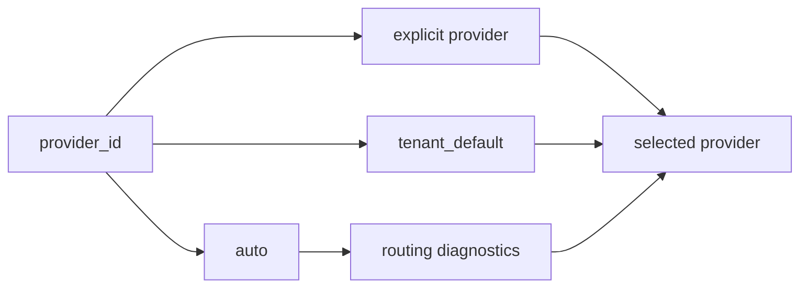

# Interactive Walkthrough

This walkthrough gives new contributors a guided path through the codebase. Follow it in order if you need to understand how a request moves from a public surface into provider execution and back out as a bundle.

## 1. Start With A Deterministic CLI Call

```bash
edc-translation submit-text "Hello world." --source en --target fr --provider deterministic_ci
```

The command enters [edc_translation/cli.py](../edc_translation/cli.py), parses `submit-text`, and dispatches to `submit_text_job` in the service layer.

## 2. Read The Service Loop

Open [edc_translation/service.py](../edc_translation/service.py). The important service functions are:

| Function | Role |
|---|---|
| `translate_document_bundle` | Validates a structured bundle, resolves a provider, translates spans, and assembles a `TranslationBundle v1`. |
| `submit_document_bundle_job` | Stores a bundle translation request as a job. |
| `submit_text_job` | Wraps raw text in a minimal document bundle and submits it. |
| `list_engine_providers` | Returns provider metadata and optional routing diagnostics. |
| `live_provider_smoke` | Runs opt-in bounded provider probes. |
| `release_readiness_status` | Reports evidence-lane readiness checks. |

## 3. Inspect Contracts

The public schemas live in two places:

| Path | Purpose |
|---|---|
| [schemas/document-bundle-v1.schema.json](../schemas/document-bundle-v1.schema.json) | Repo-root schema for external users. |
| [schemas/translation-bundle-v1.schema.json](../schemas/translation-bundle-v1.schema.json) | Repo-root schema for external users. |
| [edc_translation/schemas/](../edc_translation/schemas) | Packaged schema copies for installed distributions. |

`edc_translation/contracts.py` looks in packaged schemas and repo-root schemas so both editable installs and built packages can validate contracts.

## 4. Follow Provider Resolution

Open [edc_translation/routing.py](../edc_translation/routing.py).



The routing code is intentionally transparent. `auto` returns diagnostics when no provider is selected, rather than falling through to a live provider.

## 5. Check Provider Metadata

Run:

```bash
edc-translation list-engines --include-routing-diagnostics --source en --target fr
```

Then compare the output with provider payload construction in [edc_translation/service.py](../edc_translation/service.py) and adapter behavior under [edc_translation/engines](../edc_translation/engines).

## 6. Walk The REST Surface

Start the API:

```bash
uvicorn edc_translation.api:app --host 127.0.0.1 --port 8080
```

Open:

- `http://127.0.0.1:8080/docs`
- `http://127.0.0.1:8080/api/v1/translation/openapi-summary`
- `http://127.0.0.1:8080/admin`

The REST layer in [edc_translation/api.py](../edc_translation/api.py) should stay thin. Most behavior belongs in `service.py`, stores, routing, or provider adapters so CLI and MCP paths behave the same way.

## 7. Walk The MCP Surface

```bash
edc-translation-mcp --list-tools
```

The tool definitions are in [edc_translation/mcp.py](../edc_translation/mcp.py). The HTTP wrapper is in [edc_translation/mcp_http.py](../edc_translation/mcp_http.py). Tool calls map to service functions and scope checks in [edc_translation/auth.py](../edc_translation/auth.py).

## 8. Walk A Batch Text Job

Open [edc_translation/text_batch.py](../edc_translation/text_batch.py). The batch flow:

1. Discovers files by extension.
2. Detects or applies input encoding.
3. Submits per-file translation.
4. Writes translated text.
5. Writes optional `TranslationBundle v1` sidecars.
6. Writes logs and manifest data.

This surface is powerful and filesystem-sensitive. Shared deployments should add path restrictions outside the application.

## 9. Walk Deployment

| File | What to inspect |
|---|---|
| [Dockerfile](../Dockerfile) | Single image entry points and packaged schemas/static assets. |
| [docker-compose.local.yml](../docker-compose.local.yml) | Local API/MCP/mock runtime/Kafka smoke. |
| [docker-compose.prod.yml](../docker-compose.prod.yml) | Durable stores and auth-enforced validation. |
| [helm/edc-translation](../helm/edc-translation) | Kubernetes chart, values, and templates. |
| [gitops/argocd](../gitops/argocd) | Argo CD application scaffolding. |
| [ansible](../ansible) | Inventory-driven Helm deployment automation. |

## 10. Validation Loop

Before opening a PR:

```bash
python -m ruff check edc_translation tests
PGCONNECT_TIMEOUT=2 python -m pytest -q
python -m build
helm lint helm/edc-translation
helm template edc-translation helm/edc-translation
```

Update docs when you change setup, contracts, endpoints, CLI arguments, auth behavior, provider configuration, or deployment values.
