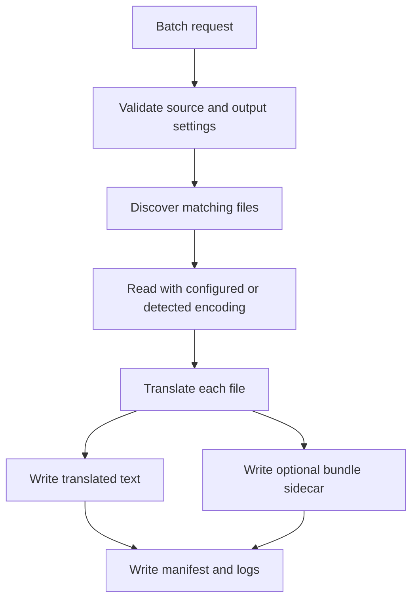

# Batch Text Workflows

Batch text workflows translate folders or individual text files while preserving relative output paths and writing optional bundle sidecars.

## When To Use

Use batch text translation when:

- You already have plain text files.
- You need deterministic local smoke over many files.
- You need translated text plus optional `TranslationBundle v1` sidecars.
- You need logs and manifest output for an operator-run job.

Do not use it as an unrestricted multi-user filesystem API.

## REST Request Shape

`POST /api/v1/translation/files/batch`

| Field | Default | Purpose |
|---|---|---|
| `source_path` | required | Input file or directory. |
| `output_dir` | required | Output directory. |
| `source_language` | `auto` | Source language tag. |
| `target_language` | required | Target language tag. |
| `provider_id` | `deterministic_ci` | Provider used for each file. |
| `input_encoding` | `auto` | Input encoding policy. |
| `output_encoding` | `utf-8` | Output encoding. |
| `recursive` | `true` | Recurse directories. |
| `file_extensions` | `[".txt"]` | File extension allow-list. |
| `write_translation_bundles` | `true` | Write bundle sidecars. |
| `write_manifest` | `true` | Write manifest. |
| `continue_on_error` | `true` | Continue after per-file failures. |

## Flow

## Output Expectations

| Output | Purpose |
|---|---|
| Translated text files | Main translated content. |
| JSON sidecars | Per-file `TranslationBundle v1` metadata when enabled. |
| Manifest | Batch summary, file counts, status, output paths. |
| Logs | Operator-facing progress and error records. |

## Safe Deployment Rules

- Restrict allowed source and output roots at the deployment layer.
- Run batch jobs as a user with least-privilege filesystem access.
- Avoid exposing this surface directly to untrusted callers.
- Keep generated outputs outside the repository working tree unless they are intended fixtures.
- Use deterministic provider for public examples and smoke tests.

## Troubleshooting

| Symptom | Likely cause |
|---|---|
| No files processed | Extension filter does not match or `source_path` is wrong. |
| Garbled output | Input encoding auto-detection guessed incorrectly; set `input_encoding`. |
| Sidecars missing | `write_translation_bundles` is false. |
| Job stops early | `continue_on_error` is false or a validation failure occurred before file processing. |
| Output path denied | Filesystem permissions or deployment path policy blocked the write. |
