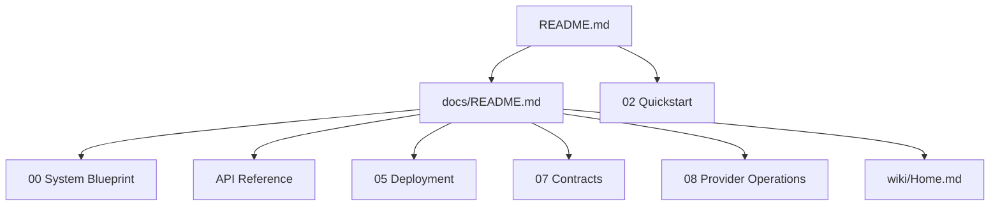

# EDC Translation Documentation

This documentation suite is the public operating manual for EDC Translation. It is organized for evaluators who need to understand the product boundary, developers who need to integrate the API or CLI, and operators who need to deploy the service without relying on private context.

> **Note**
> The deterministic provider path works without external services. CT2 model adapters, local OpenAI-compatible runtimes, OpenRouter, and Gemini require operator configuration and should be enabled only after license, retention, and quality review.

## Start Here

| Path | Audience | Use it for |
|---|---|---|
| [00 - System Blueprint](00-SYSTEM-BLUEPRINT.md) | Architects and technical evaluators | Product boundary, core components, contracts, and trust boundaries. |
| [01 - Tech Stack DNA](01-TECH-STACK-DNA.md) | Engineers | Languages, frameworks, stores, queues, provider families, and deployment technology. |
| [02 - Quickstart: 5-Minute Success](02-QUICKSTART-5-MINUTE-SUCCESS.md) | New users | Clean-clone setup, deterministic smoke, API launch, Docker smoke, and first failure checks. |
| [03 - Information Flows](03-INFORMATION-FLOWS.md) | Architects and maintainers | Request, routing, batch, worker, review, and evidence flows. |
| [04 - Use Cases](04-USE-CASES.md) | Product and platform teams | Best-fit scenarios, acceptance criteria, and non-goals. |
| [05 - Interactive Walkthrough](05-INTERACTIVE-WALKTHROUGH.md) | New contributors | Guided tour through the runtime package and the main control loops. |
| [05 - Deployment](05-DEPLOYMENT.md) | Operators | Python, Compose, Helm, GitOps, Ansible, auth, stores, workers, and rollout checks. |
| [06 - Configuration Reference](06-CONFIGURATION-REFERENCE.md) | Operators | Environment variables and configuration policy by surface. |
| [07 - Contracts Reference](07-CONTRACTS-REFERENCE.md) | Integrators | `DocumentBundle v1`, `TranslationBundle v1`, schema rules, and compatibility guidance. |
| [08 - Provider Operations](08-PROVIDER-OPERATIONS.md) | Model/runtime owners | Provider selection, auto-route behavior, local runtime readiness, model validation, and live smoke. |
| [09 - Batch Text Workflows](09-BATCH-TEXT-WORKFLOWS.md) | Operators and analysts | Folder translation, encoding handling, output manifests, logs, and safe filesystem boundaries. |
| [10 - Troubleshooting](10-TROUBLESHOOTING.md) | Support and operators | Common setup, routing, auth, Docker, Helm, Postgres, Kafka, and model-runtime failures. |
| [11 - Security and Release Readiness](11-SECURITY-AND-RELEASE-READINESS.md) | Release owners | Public-release hygiene, auth posture, evidence lanes, scans, and final sign-off checklist. |
| [API Reference](API-REFERENCE.md) | Developers | REST endpoint map, CLI commands, MCP-style tools, auth scopes, and example calls. |
| [Deployment Decision Guide](DEPLOYMENT-DECISION-GUIDE.md) | Technical leads | Which deployment path to choose and when to promote. |
| [Executive Summary](EXECUTIVE-SUMMARY.md) | Decision-makers | One-page value, scope, readiness, and evaluation framing. |
| [White Paper](WHITE-PAPER.md) | Technical stakeholders | Long-form rationale and architecture narrative. |

## Documentation Map

## Canonical Surfaces

| Surface | Canonical source | Notes |
|---|---|---|
| Product overview | [`README.md`](../README.md) | Public landing page and fastest success path. |
| Architecture overview | [`ARCHITECTURE.md`](../ARCHITECTURE.md) and [00 - System Blueprint](00-SYSTEM-BLUEPRINT.md) | Root file is compact; numbered doc is deeper. |
| Installation | [`INSTALL.md`](../INSTALL.md) and [02 - Quickstart](02-QUICKSTART-5-MINUTE-SUCCESS.md) | Quickstart is minimal; install doc covers variants. |
| REST, CLI, MCP | [API Reference](API-REFERENCE.md) | Use this as the canonical integration map. |
| Deployment | [05 - Deployment](05-DEPLOYMENT.md) | Includes local, Docker Compose, Helm, GitOps, and Ansible paths. |
| Public wiki | [`wiki/Home.md`](../wiki/Home.md) | Local source pages that can be copied into GitHub Wiki if the Wiki feature is enabled. |

## Release-Readiness Notes

- Public examples use `deterministic_ci` unless they explicitly describe an optional provider.
- Docs avoid private paths, private repo references, real customer material, and local workstation-specific values.
- Live providers are opt-in and require credentials plus `EDC_TRANSLATION_LIVE_SMOKE=1`.
- Staging and production-like deployments must not run with disabled auth.
- The repo ships schemas and deterministic test paths; it does not ship model weights.
