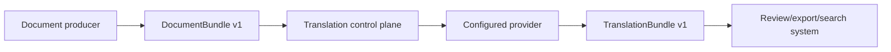

# White Paper: Contract-First Translation For Document Workflows

## Abstract

EDC Translation treats translation as infrastructure rather than a loose provider call. The system keeps document-span identity, provider metadata, quality signals, custody fields, and review decisions attached to every output bundle. This creates a translation layer that can be tested, deployed, and audited with the same discipline as the rest of a document-processing pipeline.

## Problem

Document workflows often need more than translated text. They need to know:

- Which source span produced the translated text.
- Which provider and model family handled the request.
- Whether the provider was local or cloud.
- Which license and retention class applied.
- Whether the result passed basic quality checks.
- Which review decision was recorded.
- Which deployment mode and store path produced the result.

Direct provider calls tend to hide those details unless each application rebuilds the same wrapper logic.

## Design

EDC Translation centralizes that wrapper logic behind versioned contracts and shared service functions.

## Contract Discipline

`DocumentBundle v1` is the input. `TranslationBundle v1` is the output. Both are JSON Schema contracts that can be validated outside the service. Contract validation makes integration failures obvious before provider execution.

## Provider Discipline

Providers are not treated as interchangeable strings. Provider metadata includes family, local/cloud flags, license, retention class, runtime, runtime version, and configuration status. Auto-route fails closed when it cannot select a reviewed provider.

## Deployment Discipline

The project supports a graduated path:

1. Python editable install for local development.
2. Docker Compose for multi-service local smoke.
3. Staging-like Compose for auth and durable-store checks.
4. Helm for Kubernetes rendering and deployment.
5. GitOps and Ansible for repeatable cluster operations.

## Security Discipline

Disabled auth is local-only. Live providers require explicit credentials and smoke opt-in. Batch filesystem translation should be restricted by deployment policy. Release readiness checks require evidence lanes rather than a single opaque score.

## Limits

The system does not claim translation quality superiority by itself. Quality depends on the configured provider, model, language pair, glossary, prompt/instruction policy, and review workflow. The project provides the control plane and metadata envelope needed to evaluate those choices.

## Conclusion

Contract-first translation makes translated document text easier to validate, route, review, and deploy. EDC Translation gives teams a public, reproducible foundation for that layer while leaving model choice and production policy under operator control.
