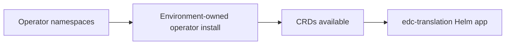

# EDC Translation Platform Operators

This directory is the GitOps sync point for cluster operator prerequisites that must exist before the production Helm profile is reconciled.

## Operator Classes

| Operator | Purpose |
|---|---|
| CloudNativePG | Postgres clusters and backup posture. |
| Strimzi | Kafka clusters, topics, and users. |
| KEDA | Queue-driven worker scaling. |
| cert-manager | Certificate issuance for ingress/TLS workflows. |
| Ingress controller | Public or private HTTP ingress, depending on environment. |
| Monitoring stack | Prometheus-compatible metrics and alerting. |

## What This Directory Does

The checked-in manifests create only the expected operator namespaces. Operator installation remains an environment-owned step because chart versions, registries, CRD policies, and credentials are cluster-specific.

## What This Directory Does Not Prove

- It does not prove that the operators are installed.
- It does not prove that CRDs are present.
- It does not create credentials.
- It does not select production chart versions.
- It does not replace platform review.

## GitOps Order

Keep operator installation separate from the application chart so Argo CD can reconcile CRDs before the `edc-translation-prod` application renders CloudNativePG, Strimzi, and KEDA custom resources.
