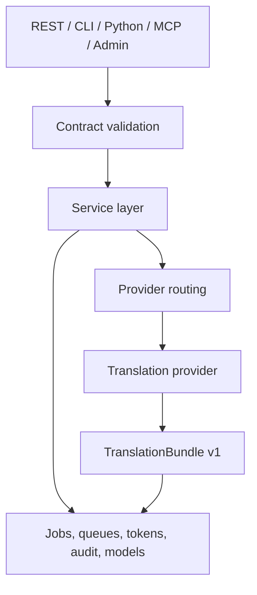

# Architecture Overview

EDC Translation is organized around a shared service layer. REST, CLI, Python, MCP, worker, and admin surfaces all converge on the same translation, routing, store, custody, and review logic.

## Main Components

| Component | File |
|---|---|
| FastAPI app | `edc_translation/api.py` |
| CLI | `edc_translation/cli.py` |
| Service layer | `edc_translation/service.py` |
| Routing | `edc_translation/routing.py` |
| Providers | `edc_translation/engines/`, `edc_translation/llm_live.py` |
| Batch text | `edc_translation/text_batch.py` |
| Worker | `edc_translation/worker.py` |
| MCP tools | `edc_translation/mcp.py`, `edc_translation/mcp_http.py` |
| Release readiness | `edc_translation/release_readiness.py` |

## Contracts

- `DocumentBundle v1` carries source document spans.
- `TranslationBundle v1` carries translated spans, provider metadata, quality fields, and evidence references.

## Deployment Shape

The same service can run as:

- Python local process.
- Docker container.
- Compose local stack.
- Kubernetes chart.
- GitOps-managed app.
- Ansible-driven Helm install.
